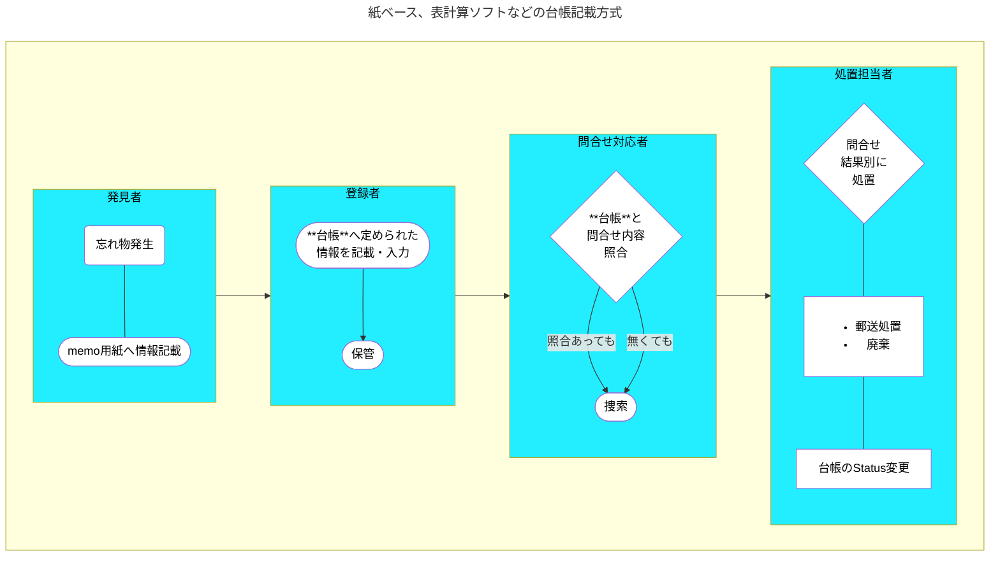
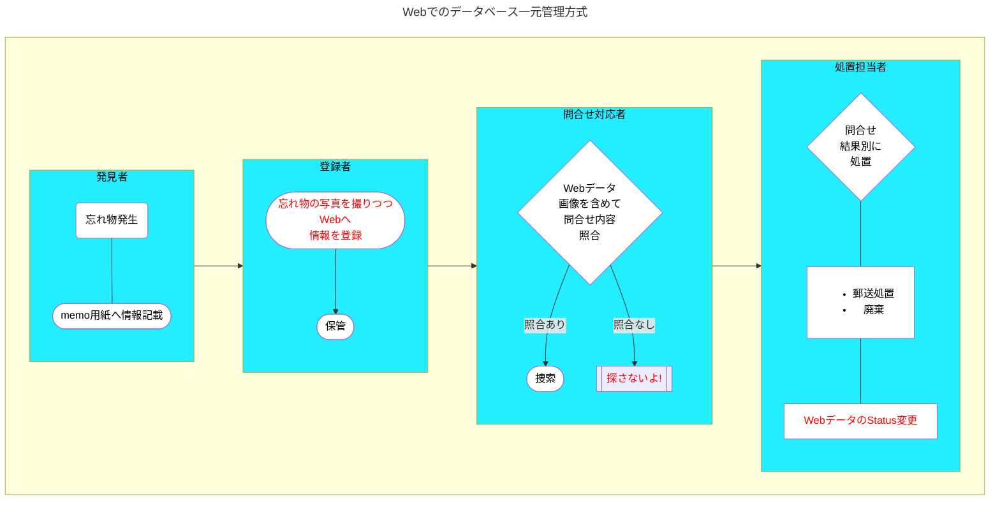
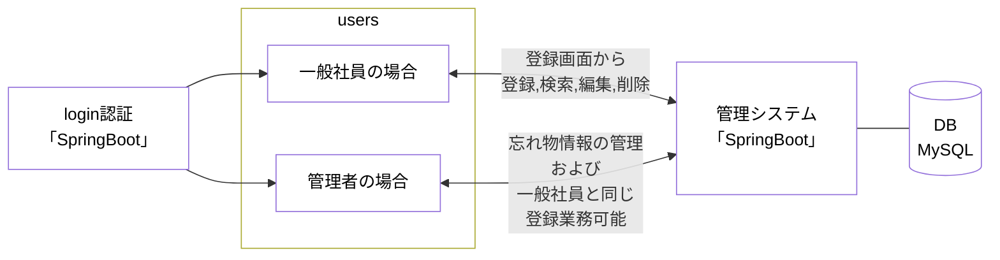

# 忘れ物管理システム要件定義書

---

## 忘れ物管理について
不特定多数の人が利用する施設、企業において、顧客の忘れ物の保管管理は必須のものである。
管理方法は、紙ベース、エクセル等の表計算ソフトを利用したものなどがある。
近年では、忘れ物の写真をタブレット端末にて撮影し、写真を含めデータベースへ登録し顧客の問合せ等に対応している企業も現存する。

## システム導入の背景と目的
顧客からの問合せに対し、いずれの管理にせよ、最終的には現品を保管場所より捜索しなければならない。
紙ベース、エクセル等による台帳方式では、顧客の忘れ物に対する説明と台帳記載の内容に相違があった場合、現品の絞り込みに労力を要する場合が発生している。

### 紙ベース、表計算ソフトなどの台帳記載方式の業務フロー

### 新システム方式の業務フロー

## システムの概要
本システムは、忘れ物の管理システムである。忘れ物の管理(登録、検索、編集、削除
)はSpring Bootで構築されるWebシステムで行う,管理者権限を持ったものが、本システムを管理する。一般社員は忘れ物情報(現物の写真データを含めた)をサーバ上のデータベースにアクセスが可能(一部制限あり)これらの忘れ物データを一元管理することにより、忘れ物の検索などが簡便化され、かつ情報の共有化を図ることが可能となる。

## 機能要件
### 管理システム機能

|機能ID|機能名|機能概要|
|---|---|---|
|LI-A-1 |ユーザー認証 |ログイン、ログアウト等の認証に関する機能|
|LI-A-2 |忘れ物登録管理 |忘れ物情報の表示、登録、編集の機能 |
|LI-B-1 |忘れ物情報管理 |発見場所、保管場所の登録機能 *1.3|
|LI-B-2 | 忘れ物データの更新情報|忘れ物データの更新情報を閲覧、削除する機能*1.1*1.3 |
|LI-B-3 |ユーザー設定 |一般社員、管理者の認証情報を追加、修正するための機能*1.3 |

### 改訂履歴

<table>
  <th>版</th><th>日付</th><th>改訂者</th><th>内容</th>
  <tr>
    <td>1.0</td>
    <td>2025/9/19</td>
    <td>安藤敦規</td>
    <td>初版作成</td>
  </tr>
  <tr>
    <td>1.1</td>
    <td>2025/09/30 </td>
    <td>〃</td>
    <td>LI-B-2 機能見直し修正</td>
  </tr>
  <tr>
    <td>1.3</td>
    <td>2025/11/01 </td>
    <td>〃</td>
    <td>機能概要修正</td>
  </tr>
  <tr>
    <td>&emsp;</td>
    <td></td>
    <td></td>
    <td></td>
  </tr>
</table>